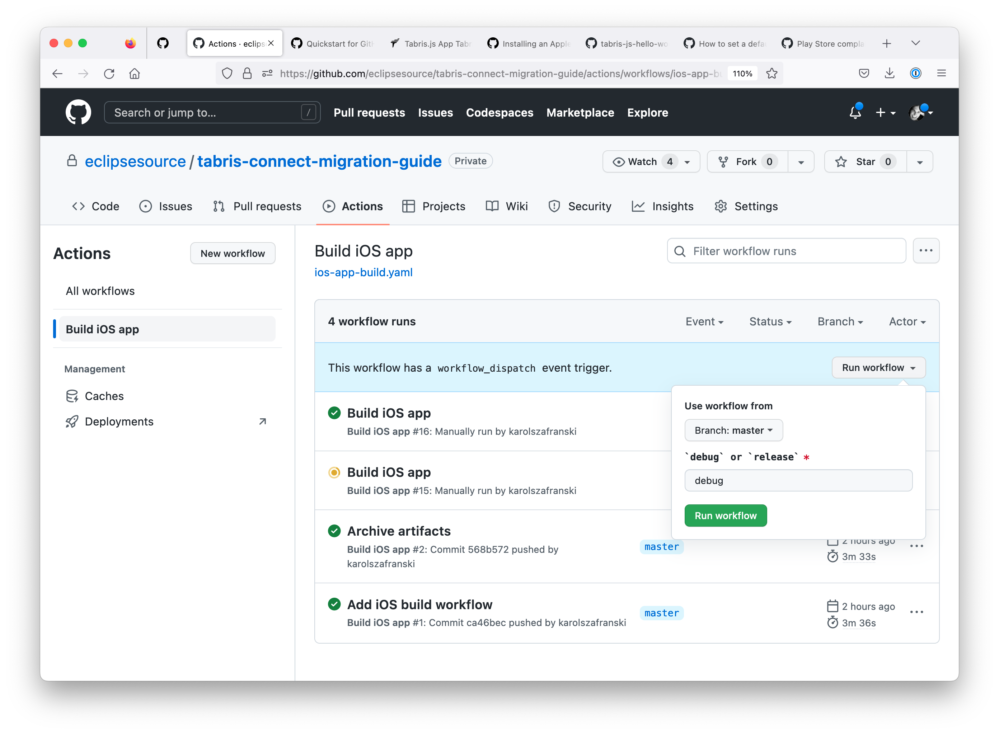

# Tabris Connect to Github Actions migration guide


## Prerequisites:

- Github repository with source code of the application that is built on Tabris Connect. You need an admin rights in order to configure secrets consumed by the build job.
	
	> Building applications which source code is hosted elsewhere is possible but out of the scope of this guide.

- Apple certificate (development or distribution) with corresponding iOS provisioning profile
  - `*.p12` file (incl passphrase if certificate was encrypted)
  - `*.mobileprovision` file
- Android signing key and its alias/passwords
- Github workflows [documentation](https://docs.github.com/en/actions/using-workflows) in case if customization of the build job is needed.

### iOS
#### Development build

1. Please read "[Create secrets for your certificate and provisioning profile](https://docs.github.com/en/actions/deployment/deploying-xcode-applications/installing-an-apple-certificate-on-macos-runners-for-xcode-development)" section of "Installing an Apple certificate on macOS runners for Xcode development" guide first.

   > The signing process involves storing certificates and provisioning  profiles, transferring them to the runner, importing them to the  runner's keychain, and using them in your build.
   >
   > To use your certificate and provisioning profile on a runner, we  strongly recommend that you use GitHub secrets. For more information on  creating secrets and using them in a workflow, see "[Encrypted secrets](https://docs.github.com/en/actions/reference/encrypted-secrets)."
   >
   > Create secrets in your repository or organization for the following items:
   >
   > - Your Apple signing certificate.
   >
   >   - This is your `p12` certificate file. For more information on exporting your signing certificate from Xcode, see the [Xcode documentation](https://help.apple.com/xcode/mac/current/#/dev154b28f09).
   >
   >   - You should convert your certificate to Base64 when saving it as a secret. In this example, the secret is named `IOS_DEVELOPMENT_BUILD_CERTIFICATE_BASE64`.
   >
   >   - Use the following command to convert your certificate to Base64 and copy it to your clipboard:
   >
   >     ```shell
   >     base64 -i BUILD_CERTIFICATE.p12 | pbcopy
   >     ```
   >
   > - The password for your Apple signing certificate.
   >
   >   - In this example, the secret is named `IOS_P12_PASSWORD`.
   >
   > - Your Apple provisioning profile.
   >
   >   - For more information on exporting your provisioning profile from Xcode, see the [Xcode documentation](https://help.apple.com/xcode/mac/current/#/deva899b4fe5).
   >
   >   - You should convert your provisioning profile to Base64 when saving it as a secret. In this example, the secret is named `IOS_DEVELOPMENT_BUILD_PROVISION_PROFILE_BASE64`.
   >
   >   - Use the following command to convert your provisioning profile to Base64 and copy it to your clipboard:
   >
   >     ```shell
   >     base64 -i PROVISIONING_PROFILE.mobileprovision | pbcopy
   >     ```
   >
   > - A keychain password.
   >
   >   - A new keychain will be created on the runner, so the password for  the new keychain can be any new random string. In this example, the  secret is named `KEYCHAIN_PASSWORD`.

2. Follow steps below to complete the tasks described above:

   - Open Actions Secrets Settings page of your repository:
     ```
     https://github.com/your-org/your-repository/settings/secrets/actions
     ```

   - Add following repository secrets:

   - Base64 encoded **development** Apple signing certificate with name: `IOS_DEVELOPMENT_BUILD_CERTIFICATE_BASE64`

   - Base64 encoded **distribution** Apple signing certificate with name: `IOS_RELEASE_BUILD_CERTIFICATE_BASE64`

   - Passphrase used for encrypting the certificates, we used the same one for both. Do not base64 encode. Use name: `IOS_P12_PASSWORD`
   - Base64 encoded **development** provisioning profile. Use name: `IOS_DEVELOPMENT_BUILD_PROVISION_PROFILE_BASE64`.
   - Base64 encoded **distribution** provisioning profile. Use name: `IOS_RELEASE_BUILD_PROVISION_PROFILE_BASE64`.
   - Any new random string that will be used as keychain password, use name: `IOS_KEYCHAIN_PASSWORD`. We used 32 character alphanumeric string generated with following command: ```pwgen 32 1```

3. **Get your Tabris.js Build Key. Go to [Tabris Account Settings Page](https://build.tabris.com/settings/account) and copy build key visible below your username. Following steps in: [Creating encrypted secrets for a repository](https://docs.github.com/en/actions/security-guides/encrypted-secrets#creating-encrypted-secrets-for-a-repository), define a new repository secret called `TABRIS_BUILD_KEY`, as a secret paste in the build key you copied.**

4. If your Tabris Connect build job had any secret environment variables configured, define them as repository secrets same as `TABRIS_BUILD_KEY`.

5. Create signing configuration file. In `./cordova` directory in your repo create `build.json` file.

6. Copy following contents into newly created file. Use yours provisioning profile identifiers.
   Open your provisioning profile with any plain text editor, search for `UUID` key and use corresponding string value below the key.

   > Note: if you do not plan to build both: debug and release apps, you can define only one signing configuration.

   ```json
   {
     "ios": {
       "debug": {
         "codeSignIdentity": "Apple Development",
         "packageType": "development",
         "provisioningProfile": "a82715ba-56f9-4ef1-ac01-b91040293a1c"
       },
       "release": {
         "codeSignIdentity": "Apple Distribution",
         "packageType": "app-store",
         "provisioningProfile": "c47b89fb-bec9-4682-861e-f88b0597b63a"
       }
     }
   }
   ```

7. In root directory of the repository with source code of the application, create following directories hierarchy `.github/workflows`.

   ```shell
   mkdir -p .github/workflows
   ```

8. Create a new file called `ios-app-build.yaml` inside of the newly created directory.

   ```shell
   touch .github/workflows/ios-app-build.yaml
   ```

9. Copy following YAML contents into the created file
   ```yaml
   name: Build iOS app
   
   on:
     push:
   
   jobs:
     build-ios:
       runs-on: macos-latest
       name: Build iOS application
       steps:
   
         - name: Install the Apple certificate and provisioning profile
           env:
             BUILD_CERTIFICATE_BASE64: ${{ secrets.IOS_DEVELOPMENT_BUILD_CERTIFICATE_BASE64 }}
             P12_PASSWORD: ${{ secrets.IOS_P12_PASSWORD }}
             BUILD_PROVISION_PROFILE_BASE64: ${{ secrets.IOS_DEVELOPMENT_BUILD_PROVISION_PROFILE_BASE64 }}
             KEYCHAIN_PASSWORD: ${{ secrets.IOS_KEYCHAIN_PASSWORD }}
           run: |
             # create variables
             CERTIFICATE_PATH=$RUNNER_TEMP/build_certificate.p12
             PP_PATH=$RUNNER_TEMP/build_pp.mobileprovision
             KEYCHAIN_PATH=$RUNNER_TEMP/app-signing.keychain-db
   
             # import certificate and provisioning profile from secrets
             echo -n "$BUILD_CERTIFICATE_BASE64" | base64 --decode --output $CERTIFICATE_PATH
             echo -n "$BUILD_PROVISION_PROFILE_BASE64" | base64 --decode --output $PP_PATH
   
             # create temporary keychain
             security create-keychain -p "$KEYCHAIN_PASSWORD" $KEYCHAIN_PATH
             security set-keychain-settings -lut 21600 $KEYCHAIN_PATH
             security unlock-keychain -p "$KEYCHAIN_PASSWORD" $KEYCHAIN_PATH
   
             # import certificate to keychain
             security import $CERTIFICATE_PATH -P "$P12_PASSWORD" -A -t cert -f pkcs12 -k $KEYCHAIN_PATH
             security list-keychain -d user -s $KEYCHAIN_PATH
   
             # apply provisioning profile
             mkdir -p ~/Library/MobileDevice/Provisioning\ Profiles
             cp $PP_PATH ~/Library/MobileDevice/Provisioning\ Profiles
   
         - name: Checkout
           uses: actions/checkout@v3
           with:
             fetch-depth: 1
   
         - name: Install tabris-cli
           run: npm install -g tabris-cli
           
         - name: Install application dependencies
           run: |
           	npm run --if-present prepare
           	npm install
   
         - name: Build application
           env:
             TABRIS_BUILD_KEY: ${{ secrets.TABRIS_BUILD_KEY }}
           run: |
             tabris build ios --debug --device --verbose
   
         - name: Prepare artifacts for archival
           run: |
             mkdir -p artifacts
             printenv | grep GITHUB_ > artifacts/env-gha
             cp -R \
               "$(find . -iname "*.app.dSYM")" \
               "$(find . -iname "*.ipa")" \
               artifacts
             tar cf artifacts.tar artifacts
   
         - name: Archive metadata
           uses: actions/upload-artifact@v3
           with:
             name: artifacts.tar
             path: artifacts.tar
             retention-days: 30
   
         - name: Cleanup
           if: always()
           run: |
             security delete-keychain $RUNNER_TEMP/app-signing.keychain-db
             rm ~/Library/MobileDevice/Provisioning\ Profiles/build_pp.mobileprovision
   ```
   
10. Commit changes and push to Github. Build should start automatically and you can observe its progress here:

    ```
    https://github.com/your-org/your-repository/actions
    ```


## Parameterized build (release or debug)

You can have a parameterized job that can produce development or distrubition build, depending on input variable. This workflow has to be triggered manually on Github. Create another yaml file, named `ios-app-build-manual.yaml`. It will never be executed automatically, but you can trigger it from withing Githubs web UI manually. Use following build configuration:

```yaml
name: Manual iOS app build

on:
  workflow_dispatch:
    inputs:
      build_type:
        description: '`debug` or `release`'
        required: true
        default: 'debug'

jobs:
  build-ios:
    runs-on: macos-latest
    name: Build iOS application
    steps:

      - name: Install the Apple certificate and provisioning profile
        env:
          BUILD_CERTIFICATE_BASE64: ${{ github.event.inputs.build_type == 'release' && secrets.IOS_RELEASE_BUILD_CERTIFICATE_BASE64 || secrets.IOS_BUILD_CERTIFICATE_BASE64 }}
          P12_PASSWORD: ${{ secrets.P12_PASSWORD }}
          BUILD_PROVISION_PROFILE_BASE64: ${{  github.event.inputs.build_type == 'release' && secrets.RELEASE_BUILD_PROVISION_PROFILE_BASE64 || secrets.BUILD_PROVISION_PROFILE_BASE64 }}
          KEYCHAIN_PASSWORD: ${{ secrets.KEYCHAIN_PASSWORD }}
        run: |
          # create variables
          CERTIFICATE_PATH=$RUNNER_TEMP/build_certificate.p12
          PP_PATH=$RUNNER_TEMP/build_pp.mobileprovision
          KEYCHAIN_PATH=$RUNNER_TEMP/app-signing.keychain-db

          # import certificate and provisioning profile from secrets
          echo -n "$BUILD_CERTIFICATE_BASE64" | base64 --decode --output $CERTIFICATE_PATH
          echo -n "$BUILD_PROVISION_PROFILE_BASE64" | base64 --decode --output $PP_PATH

          # create temporary keychain
          security create-keychain -p "$KEYCHAIN_PASSWORD" $KEYCHAIN_PATH
          security set-keychain-settings -lut 21600 $KEYCHAIN_PATH
          security unlock-keychain -p "$KEYCHAIN_PASSWORD" $KEYCHAIN_PATH

          # import certificate to keychain
          security import $CERTIFICATE_PATH -P "$P12_PASSWORD" -A -t cert -f pkcs12 -k $KEYCHAIN_PATH
          security list-keychain -d user -s $KEYCHAIN_PATH

          # apply provisioning profile
          mkdir -p ~/Library/MobileDevice/Provisioning\ Profiles
          cp $PP_PATH ~/Library/MobileDevice/Provisioning\ Profiles

      - name: Checkout
        uses: actions/checkout@v3
        with:
          fetch-depth: 1

      - name: Install tabris-cli
        run: npm install -g tabris-cli
        
      - name: Install application dependencies
        run: |
        	npm run --if-present prepare
        	npm install

      - name: Build application
        env:
          TABRIS_BUILD_KEY: ${{ secrets.TABRIS_BUILD_KEY }}
        run: |
          tabris build ios --${{ github.event.inputs.build_type }} --device --verbose

      - name: Prepare artifacts for archival
        run: |
          mkdir -p artifacts
          printenv | grep GITHUB_ > artifacts/env-gha
          cp -R \
            "$(find . -iname "*.app.dSYM")" \
            "$(find . -iname "*.ipa")" \
            artifacts
          tar cf artifacts.tar artifacts

      - name: Archive metadata
        uses: actions/upload-artifact@v3
        with:
          name: artifacts.tar
          path: artifacts.tar
          retention-days: 30

      - name: Cleanup
        if: always()
        run: |
          security delete-keychain $RUNNER_TEMP/app-signing.keychain-db
          rm ~/Library/MobileDevice/Provisioning\ Profiles/build_pp.mobileprovision
```

Push changes to Github.

This workflow has to be triggered manually on Github. Go to "Actions" tab, select "Build iOS app" workflow in the left side sidebar. In the main part of the view, just below table header there should be an information about available `workflow_dispatch` trigger. Right to that message "Run workflow" button can be used for triggering a build.



### Android

1. Provide signing key and its alias/passwords in the github project settings under `Security -> Actions -> Repository Secrets`.

    The following keys need to be used:

      * `ANDROID_APP_BUNDLE_KEYSTORE_PASSWORD`
      * `ANDROID_APP_BUNDLE_KEY_ALIAS`
      * `ANDROID_APP_BUNDLE_KEY_PASSWORD`
      * `ANDROID_APP_BUNDLE_SIGNING_KEY` (base64 encoded)
      * `TABRIS_BUILD_KEY` (already created during the iOS setup step)

    Note that the `ANDROID_APP_BUNDLE_SIGNING_KEY` has to be in Java keystore format (*.jks) and base64 encoded. When a new key is created it is advisable to follow the  [Android key generation documentation](https://developer.android.com/studio/publish/app-signing#generate-key). You can download existing keys on Tabris connect from the user menu.

2. Create a new file called `android-app-build.yaml` inside of the `.github/workflows/` directors.

   ```shell
   touch .github/workflows/android-app-build.yaml
   ```

3. Insert the following script into the yaml file.

    ```yml
    name: Build Tabris.js app for Android

    on:
      push:
        branches:
          - main

    jobs:
      build_android_app:

        runs-on: ubuntu-latest

        steps:
          - name: Checkout source
            uses: actions/checkout@v3.1.0

          - name: Setup java
            uses: actions/setup-java@v3.6.0
            with:
              distribution: adopt
              java-version: 11

          - name: Setup gradle
            uses: gradle/gradle-build-action@v2.3.3

          - name: Install tabris-cli
            run: npm install -g tabris-cli

          - name: Install application dependencies
            run: |
              npm run --if-present prepare
              npm install            

          - name: Execute build
            env:
              TABRIS_BUILD_KEY: ${{ secrets.TABRIS_BUILD_KEY }}
            run: |
              tabris build --release android -- --packageType=bundle

          - name: Sign release app bundle
            uses: r0adkll/sign-android-release@v1.0.4
            id: sign_app
            with:
              releaseDirectory: build/cordova/platforms/android/app/build/outputs/bundle/release
              signingKeyBase64: ${{ secrets.ANDROID_APP_BUNDLE_SIGNING_KEY }}
              keyStorePassword: ${{ secrets.ANDROID_APP_BUNDLE_KEYSTORE_PASSWORD }}
              alias: ${{ secrets.ANDROID_APP_BUNDLE_KEY_ALIAS }}
              keyPassword: ${{ secrets.ANDROID_APP_BUNDLE_KEY_PASSWORD }}

          - name: Store signed app bundle
            uses: actions/upload-artifact@v3.1.1
            with:
              name: signed-app-bundle
              path: ${{ steps.sign_app.outputs.signedReleaseFile }}
              retention-days: 7
    ```

4. Push changes to Github and observe the app build.
